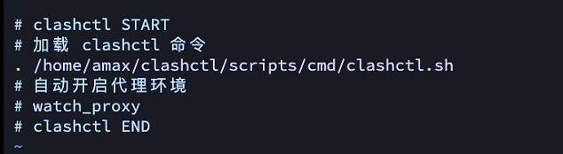

<h2 align="center">🛰️ Clash for Linux 部署 & 配置</h1>

<p align="center">
  <i> —— 2026.03.25</i>
</p>


<p align="center">
  
  
  
</p>

---

本仓库记录了Clash for Linux的部署与配置教程，仅需导入订阅链接，即可让服务器访问外网资源

---

## 🔧 Step 1：一键安装

在终端中执行以下命令即可完成安装：

```bash
git clone --branch master --depth 1 https://gh-proxy.org/https://github.com/nelvko/clash-for-linux-install.git \
  && cd clash-for-linux-install \
  && bash install.sh
```

## 🔗 Step 2：常用命令一览

```bash
Commands:
    clashctl on                    开启代理
    clashctl off                   关闭代理
    clashctl status                内核状况 (查看Clash mihomo 的进程ID、启动命令、配置文件路径)
    clashctl proxy                 系统代理 (输出当前终端已经配置好的代理环境变量)
    clashctl ui                    Web 面板
    clashctl secret                Web 密钥
    clashctl sub                   订阅管理
    clashctl upgrade               升级内核
    clashctl tun                   Tun 模式
    clashctl mixin                 Mixin 配置
Abbreviation:
    clashon                        开启代理
    clashoff                       关闭代理

View Help Info:
    clashctl -h
    clashctl -help
```

## 🛠 Step 3：关闭开机自动运行 (可选)

注释掉.bashrc中的 watch_proxy



---


